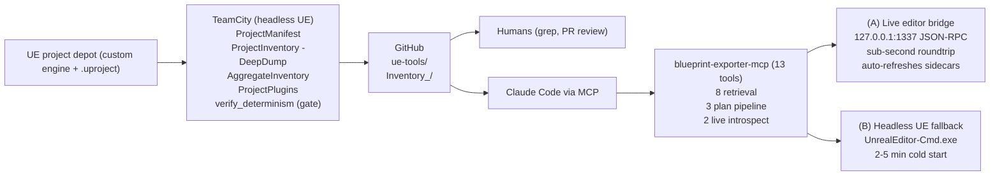

# TenChambers Blueprint Exporter

A 10 Chambers UE 5.7 editor plugin that turns a live Unreal project into **deep, deterministic, grep-able inventory** — per-asset Markdown + structured JSON for every Blueprint, StateTree, BehaviorTree, DataTable, EnvQuery, ChooserTable, SmartObject, Mutable CustomizableObject / Instance / MacroLibrary, Widget / Anim / Control Rig BP, plus project-wide rollups (class tree, dependency graph, replication matrix, domain overviews). A companion **MCP server** serves that inventory to Claude Code so AI edits have accurate context instead of hallucinated schema — and **when the editor is running, Claude Code talks to it directly over a localhost bridge, so `validate_plan` / `apply_plan` round-trip in sub-second** instead of paying a 2–5 min `UnrealEditor-Cmd.exe` cold start per call. Touched assets get their inventory sidecars (`.md` / `.meta.json` / `.deep.md`) refreshed automatically at the end of each plan run.

## How it fits together



**Four audiences, four entry points:**

1. **Someone reading the inventory on GitHub.** Go to `Inventory_<ProjectName>/INDEX.md` in the target branch. Everything else (CLASS_TREE, DEPENDENCY_GRAPH, per-asset `.md` / `.deep.md`) is linked from there.
2. **Someone using Claude Code against the committed inventory.** Wire up the MCP server — see [`scripts/blueprint-exporter-mcp/README.md`](scripts/blueprint-exporter-mcp/README.md). Five-minute setup. Reads inventory from disk; no UE needed for retrieval.
3. **Someone driving live edits into their running UE editor via Claude Code.** Same MCP setup, but keep the UE editor open — `apply_plan` / `validate_plan` route through the local bridge so each roundtrip is sub-second, and the inventory sidecars for touched assets refresh themselves. See [Live editor workflow](#live-editor-workflow) below.
4. **Someone running the plugin locally against their own UE project, no Claude Code.** Drop `BuiltPlugin/` into `<Engine>/Plugins/Editor/BlueprintExporter/` and use the editor UI or CLI. See [Local editor usage](#local-editor-usage).

---

## Inventory pipeline

The pipeline is four commandlets. Output is **byte-identical across repeated runs** (enforced by the determinism gate).

```bash
# Phase 0 — asset-registry scan only, no asset loads (fast; produces MANIFEST.md)
UnrealEditor-Cmd.exe Project.uproject -run=ProjectManifest -OutDir=./Inventory_<Project>

# Phase 1 — streams every logic-bearing asset, emits per-asset .md + .meta.json.
# Add -DeepDump for Tier 2 (per-asset .deep.md with pin-level graphs / per-node data).
UnrealEditor-Cmd.exe Project.uproject -run=ProjectInventory -OutDir=./Inventory_<Project> -DeepDump

# Phase 2 — reads .meta.json fan-in, no asset loads, emits rollups
UnrealEditor-Cmd.exe Project.uproject -run=AggregateInventory -OutDir=./Inventory_<Project>

# Plugin metadata + native-type reflection (registered UClasses for EQS / StateTree / BT / etc.)
UnrealEditor-Cmd.exe Project.uproject -run=ProjectPlugins -OutDir=./Inventory_<Project>
```

**What you get per asset:**
- `<Path>.md` — Tier 1 summary: identity, inheritance, variables, functions, components, graphs, references, coverage notes.
- `<Path>.meta.json` — structured data; the aggregate phase consumes this (no asset re-loads).
- `<Path>.deep.md` — Tier 2 full detail (with `-DeepDump`): pin-level graph dump for Blueprints (including state-machine AnimGraphs + transition RuleGraphs inline), per-task instance data for StateTrees, per-row fields for DataTables, per-option + per-test UPROPERTY tables for EnvQuery, full decision tables for ChooserTable, recursive instanced-subobject trees for `UAIPerceptionComponent` sense configs / GAS attribute defaults / anim instance layers, Mutable CustomizableObject parameter/state/component schema + authored node graph (and matching parameter overrides for CustomizableObjectInstance, per-macro authoring surface for CustomizableObjectMacroLibrary).

**Project-wide rollups:**
- `INDEX.md` — navigation + trust-signals glossary (`[BROKEN]`, `[instanced]`, `**Truncated**`, etc.).
- `CLASS_TREE.md`, `DEPENDENCY_GRAPH.md` (+ `.dot`), `REPLICATION_MATRIX.md`, `HEALTH_REPORT.md`.
- Domain overviews: `AI_OVERVIEW.md`, `ANIM_OVERVIEW.md`, `UI_OVERVIEW.md`, `GAS_OVERVIEW.md` (conditional), `STRUCTS_ENUMS.md`.
- `MANIFEST.md` — Phase 0 asset-registry scan (no asset loads).
- `PLUGINS.md` + `PluginInventory/<Name>.{md,meta.json}` — project-plugin descriptor metadata (modules, deps, category, version) plus registered native types.

**Asset coverage** (typed handlers + Tier 2 deep dumps): `Blueprint`, `AnimBlueprint`, `WidgetBlueprint`, `ControlRigBlueprint`, `StateTree`, `BehaviorTree`, `EnvQuery`, `SmartObjectDefinition`, `ChooserTable`, `PoseSearchDatabase`, `DataTable`, `UserDefinedStruct`, `UserDefinedEnum`, `CustomizableObject` / `CustomizableObjectInstance` / `CustomizableObjectMacroLibrary` (Mutable plugin, gated on `WITH_MUTABLE_SUPPORT`).

### Determinism gate

```powershell
pwsh -File scripts/verify_determinism.ps1 -Project <BugHunt|DOW> -SweepDeepDump
```

PASS = `[verify] PASS -- both output trees are byte-identical.` FAIL preserves `_determinism_A/`, `_determinism_B/`, and a unified diff at `<OutA>.diff` for inspection. Run it before any commit that touches `Source/` or `BuiltPlugin/` — mandatory gate for the CI job too.

### Exit codes

`0` all good · `1` validation issues · `2` something broke.

---

## MCP server — for Claude Code

The pushed inventory is just Markdown + JSON on GitHub; Claude Code can grep it directly. The MCP server adds three things on top:

1. **Structured access** — `get_asset_summary`, `get_references`, `get_class_tree`, `search_deep_dumps`, etc. (8 zero-UE-process retrieval tools) for when you want typed answers, not `grep` output.
2. **Live introspection** — `deep_dump_asset` and `refresh_inventory` shell to headless UE on demand when the committed inventory is stale.
3. **Plan pipeline** — `validate_plan` + `apply_plan` — Claude Code writes an edit plan (JSON), the validator checks it, the executor runs it through UE's own save/compile paths with a mechanical-diff oracle. No JSON round-trip, no deserializer fidelity risk. Atomic per op. Routes through the [live editor bridge](#live-editor-workflow) when the editor is running (sub-second), falls back to spawning `UnrealEditor-Cmd.exe` when it isn't (2–5 min cold start).

Full details, tool schemas, config snippets for Claude Code / Cursor / Claude Desktop: [`scripts/blueprint-exporter-mcp/README.md`](scripts/blueprint-exporter-mcp/README.md).

---

## Live editor workflow

If you keep a UE editor open with this plugin loaded, the MCP plan pipeline talks to it directly over a localhost WebSocket bridge. The difference is night-and-day: every `validate_plan` / `apply_plan` is sub-second instead of 2–5 minutes.

**What lights up when the editor is running:**

| Feature | Cold-start (subprocess fallback) | Editor bridge |
|---|---|---|
| `validate_plan` roundtrip | 2–5 min | **sub-second** |
| `apply_plan` roundtrip | 2–5 min | **sub-second** |
| Plan-of-plans iteration loop (5 sequential ops) | 10–25 min | **~5 s total** |
| Auto-refresh of touched assets' `.md` / `.meta.json` / `.deep.md` | ✗ (run `refresh_inventory` manually) | ✓ (response carries `reExport.scopedPaths` + `wroteFiles`) |
| Transport marker on response | `transport: "subprocess"` | `transport: "bridge"` |

### What you can edit live

Every op below runs through UE's own save / compile paths (no JSON round-trip, no deserializer fidelity risk), is atomic per op, is idempotent on replay (same value twice = no-op the second time), and — when the bridge is active — triggers an auto-refresh of the touched asset's inventory sidecars. Authoritative per-op kwargs live in `get_op_catalog`; the schema guide is `scripts/python_ops/plans/README.md`.

| Op | Targets | What it does |
|---|---|---|
| `set_bp_variable_default` | Blueprint (any subclass) | Change a BP-declared variable's default value on the generated class CDO. Covers every type the UE Python binding surfaces (int / float / bool / FName / FString / enum / struct / Object refs / Vector / Rotator / LinearColor / TArray / ...). |
| `set_component_property` | Blueprint (Actor) | Change a non-default property on an SCS component template (e.g. `StaticMeshComponent.StaticMesh`, `AIPerceptionComponent.bHearNoises`, `MovementComponent.MaxWalkSpeed`). |
| `set_instanced_subobject_property` | Blueprint (Actor / GAS / AI) | Reach into an `EditInlineNew` / `Instanced` subobject and set one of its fields. Covers the deep cases — AIPerception sense-config `SightRadius`, GAS attribute-set `MaxHealth`, anim layer blend weights, etc. The M9 instanced-subobject tree is the exact authoring surface this op edits. |
| `implement_interface_function` | Blueprint + BP Interface | Author a passthrough / pure-forwarder override of an interface function — creates the override graph, wires the return node to existing class members, compiles cleanly. Deliberately scoped to the passthrough case; arbitrary logic authoring is not shipped (see gaps below). |
| `create_child_bp` | Blueprint (any parent) | Create a new Blueprint subclass. Parent can be native (`/Script/Engine.Actor`) or BP (`/Game/.../BP_Parent`). |
| `rename_asset` | any | Rename or move an asset with redirector fixup; the old package is deleted, the new package is created, dependent references update. |
| `add_statetree_enter_condition` | StateTree | Add an EnterCondition node to a state. Condition is specified by a BP class path (the authored `ST_Cond_*` BP subclass of the EnterCondition base); all UPROPERTYs on the condition's CDO are carried into the state-tree editor data. |
| `remove_statetree_enter_condition` | StateTree | Remove an EnterCondition from a state. Index-based to disambiguate when multiple conditions of the same class exist. |
| `add_statetree_transition` | StateTree | Add a transition with a given trigger (`OnStateCompleted` / `Succeeded` / `Failed` / `OnTick` / `OnEvent` / `NextState`) and target state. |
| `remove_statetree_transition` | StateTree | Remove a transition from a state. |
| `verify_state_enter_conditions` (read-only) | StateTree | Inspect a state's EnterConditions without mutating. |
| `verify_state_transitions` (read-only) | StateTree | Inspect a state's Transitions without mutating. |

### What you can't edit live (yet)

These are **not** rough edges of the live bridge — they're ops that simply aren't in the library yet. They'd work just as well via the bridge as via the subprocess; the limitation is at the op layer, not the transport.

- **Arbitrary graph-node authoring** — no generic "add a K2Node" / "wire these two pins" ops. M26.1 shipped the narrow `implement_interface_function` passthrough case (uses five new UFUNCTIONs on `UBpxReflectionOps`); M26.2 (`add_bp_function`, `set_function_return_values`) and M26.3 (general graph composition) are scoped but deferred until a concrete edit target forces them.
- **Non-passthrough function logic** — you can create an override that forwards `this.Foo` to a return pin; you can't yet author "get variable, compare, branch, set variable" inside a function graph.
- **BehaviorTree / DataTable / EnvQuery / ChooserTable / SmartObjectDefinition / Mutable CustomizableObject family / DataAsset instance edits** — the exporters render these at Tier 2 (full UPROPERTY dumps) but the plan library has no write ops targeting them yet. Bridge re-export of these asset types also falls through with `status: "unsupported"` — any edit has to go through the editor UI and then `refresh_inventory`.
- **Widget Blueprint tree edits** — UMG slot properties, widget hierarchy insertions / moves, anchor / slot-class changes. Read path is fine (WidgetBP inventory renders the tree); write path isn't shipped.
- **AnimBlueprint graph / state-machine edits** — state machine structure, transitions, blend settings, AnimGraph node authoring. Read path renders state machines at Tier 1 and full AnimGraphs at Tier 2; write path isn't shipped.
- **CDO overrides on inherited C++ properties outside of the three specialized ops above** — `set_bp_variable_default` hits *BP-declared* variables only. A GameplayEffect's `DurationPolicy` (inherited from `UGameplayEffect`) or a GA's `AbilityTags` would need a new `set_cdo_property` op; not shipped.
- **Material / Niagara / Level / World / Editor Utility Widget edits** — not in scope for this plugin. These have their own editor-scripting surfaces in UE.
- **Level Blueprints** — not supported by the export or edit paths at all.
- **Anything requiring a compile-time C++ change** — adding new UPROPERTYs, registering new ops, etc. These go through the plugin's C++ layer, not the runtime plan pipeline.

If you hit a "not yet supported" case, the honest path is: author the edit in the UE editor UI by hand, commit, and move on. Filing a follow-up milestone request is welcome — most gaps above are one or two C++ UFUNCTIONs plus a Python wrapper away.

**How it works under the hood:**

- Plugin starts a JSON-RPC 2.0 server bound to `127.0.0.1:1337` (override with `BPX_BRIDGE_PORT`) inside the editor's `StartupModule`.
- MCP's `apply_plan` / `validate_plan` try the bridge first — on success the response is authoritative; on connect-refused / handshake-timeout the MCP falls through to today's subprocess shelling with zero caller-visible changes.
- Inside the editor, plan handlers invoke `scripts/python_ops/plan_executor.py` via `IPythonScriptPlugin::ExecPythonCommandEx` with `EPythonFileExecutionScope::Private` — same library calls as the subprocess path, guaranteed namespace isolation per plan, no state leaks between runs.
- After a successful `apply_plan`, the editor scopes a re-export across every asset the mechanical diff observed changing (plus plan-expected mutations for idempotent-skip replays), regenerates its three inventory sidecars in-process via `FBlueprintSerializer` + `DeepDump` renderer, and embeds a `reExport: {scopedPaths[], wroteFiles[], errorCount, perAsset[]}` block in the response. Your next `get_asset_deep_dump` / `get_asset_meta` call sees ground truth.
- Loopback-only; no auth; editor compiles out the entire bridge when the stock `WebSocketNetworking` plugin isn't present (clean builds on engines without it).

**What re-export covers (and what it doesn't):**

- ✓ **`UBlueprint` family** (`Blueprint`, `AnimBlueprint`, `WidgetBlueprint`, `ControlRigBlueprint`) — covers 100% of current plan ops: `set_bp_variable_default`, `set_component_property`, `set_instanced_subobject_property`, `create_child_bp`, `implement_interface_function`, `rename_asset`.
- ✓ **`UStateTree`** — covers `add_statetree_enter_condition`, `remove_statetree_enter_condition`, `add_statetree_transition`, `remove_statetree_transition`.
- ✗ Other asset types (BT, DT, Chooser, EQS, SmartObject, Mutable CustomizableObject family, DataAsset instances) — surfaced in the response with `status: "unsupported"` and need a follow-up `refresh_inventory` if their sidecars matter downstream.
- ✗ Project-level rollups (`CLASS_TREE.md`, `DEPENDENCY_GRAPH.md`, `HEALTH_REPORT.md`, domain overviews) — still regenerated only by the full `refresh_inventory` sweep.
- All three files (`.md` / `.meta.json` / `.deep.md`) are the full canonical format — byte-identical to what `refresh_inventory` would produce for the touched assets. M27.3.1 factored the commandlet's per-type emitters into a shared `InventoryEmit/PerAssetEmit` module so both code paths produce identical output by construction.
- Opt out with `apply_plan(plan_json, confirm=True, re_export=False)` for benchmarking or when you want the faster raw run.

**No setup beyond "open the editor":** Start UE with this plugin enabled, wait for the `Bridge server listening on 127.0.0.1:1337` line in the log (~6 s after plugin load on a warm editor), and every subsequent MCP plan call just works. Close the editor and the fallback takes over — same plans, same responses, just slower.

**Health-checking the bridge (M27.4):** `python scripts/smoke_bridge.py` against a running editor round-trips every registered method plus known-error paths (unknown method / malformed JSON / missing `jsonrpc`) and categorizes each as OK / EXPECTED_ERROR / FAILURE. Exits 0 iff every test lands in OK or EXPECTED_ERROR. Useful as a pre-flight after a DLL swap or before running a real plan; also serves as self-documenting example JSON-RPC against the bridge. The new `list_methods` method is there for discovery — ping it to see every registered handler plus a one-line description of its params.

---

## Local editor usage

The plugin still works as a drop-in editor tool. This is the **secondary** path — most consumption now goes through the CI-published inventory + MCP — but individual devs running a one-off export locally can still do so from the editor or CLI.

### Install

Copy `blueprint-exporter/BuiltPlugin/` into one of:

- `<Engine>/Plugins/Editor/BlueprintExporter/` — available to all projects on that engine
- `<YourProject>/Plugins/BlueprintExporter/` — that project only

The destination folder must be named `BlueprintExporter` (UE matches folder name to the `.uplugin`). Then start UE. **First startup takes 30–60 s** while UE rebuilds against your exact hotfix; subsequent launches are instant. If the rebuild fails, ping `#claude-code`.

**Requires Unreal Engine 5.7**, Win64. Any hotfix (5.7.3, 5.7.4, …) works.

### Editor UI

- **Export single Blueprints:** Content Browser → right-click → Blueprint Exporter → Export to JSON.
- **Export a folder:** right-click folder → Blueprint Exporter → Export All in Folder (or with Dependencies).

Export produces `<Name>.json` (full), `<Name>.txt` (scannable summary), `<Name>.digest.json` (stats), and a batch `manifest.json`. State Trees add `<Name>.statetree.json`.

### Applying edits back into Unreal

Use the MCP `apply_plan` tool — it runs named Python ops through UE's own save / compile paths and gets a mechanical-diff oracle for free, with no JSON-round-trip fidelity risk. If the editor is running, roundtrip is sub-second and touched-asset sidecars refresh automatically (see [Live editor workflow](#live-editor-workflow)); if not, it shells to `UnrealEditor-Cmd.exe` and takes 2–5 min per call. Atomic per op, not per plan — if op 3 of 5 fails, ops 1–2 are already on disk; rollback is the caller's responsibility (`git checkout` / `p4 revert`). Catalog of available ops: `get_op_catalog` MCP tool, or `scripts/python_ops/` directly. Full agent-loop walkthrough with a worked example: `scripts/python_ops/plans/AGENT_LOOP.md`.

---

## CLI reference

### Export (single Blueprint / folder)
```
-Paths="/Game/..."     Asset path(s) to export
-Out="./Exports"       Output directory
-IncludeDeps           Also export dependencies
-Depth=2               Dependency depth
-IncludeStateTrees     Also export State Trees in Paths
-NoText                Skip .txt files
-Compact               Minified JSON
```

See [Inventory pipeline](#inventory-pipeline) above for `-run=ProjectManifest` / `-run=ProjectInventory` / `-run=AggregateInventory` / `-run=ProjectPlugins` flags.

---

## Asset coverage

**Works great** (single-asset BlueprintExport + inventory pipeline):
- Blueprints — all standard subclasses (Normal, Const, Interface, Function Library, Macro Library, Level Script)
- Animation Blueprints — state machines, transitions, blend settings, nested state machines
- Widget Blueprints, Control Rig Blueprints — event graph + subclass metadata
- State Trees — full hierarchy, transitions, tasks, evaluators, conditions, property bindings
- Event graphs, functions, macros, construction scripts
- Variables (all types, defaults, flags), functions (signatures, pure/impure)
- Components — SCS hierarchy, non-default properties, parent/child attach
- **Instanced-subobject properties** — AI Perception sense configs, GAS attribute sets, anim instance layers, anything tagged `EditInlineNew` / `Instanced`. Nested values (sight radius, hearing range, affiliation, etc.) surface in `.json` / `.txt` / `.deep.md` instead of being hidden in an opaque blob.
- K2Node handling — Event, CallFunction, Variable Get/Set, IfThenElse, DynamicCast, MakeStruct/BreakStruct, Switch variants; generic fallback for the rest.
- Type inference for unresolved pin types (~90% resolution, explicit `bTypeInferred: false` markers when inference fails).
- Interfaces, timelines, node comments + positions.
- CDO property overrides on generated class — diff against parent CDO so GameplayEffect modifiers, GameplayAbility cost/cooldown/tags, DataAsset inherited fields, natively-declared Instanced components (`ACharacter::CharacterMovement` / `Mesh` / `ArrowComponent`) all surface.
- JSON round-trip at schema level (export → re-parse → export = byte-identical).

**Inventory pipeline only** (typed handlers + Tier 2; NOT in single-asset BlueprintExport):
- Behavior Trees (+ Blackboard key list)
- EnvQuery (per-option + per-test UPROPERTY tables)
- DataTable (per-row field tables)
- SmartObjectDefinition (including `StateTreeReference` link to driving ST)
- ChooserTable (full decision tables)
- PoseSearchDatabase (Tier 1 only — schema / animations / normalization)
- UserDefinedStruct, UserDefinedEnum
- Mutable CustomizableObject (parameter schema + states + components + compile options + authored node graph; compiled-model blob skipped as non-deterministic), CustomizableObjectInstance (9 typed parameter-override arrays from `FCustomizableObjectInstanceDescriptor`), CustomizableObjectMacroLibrary (per-macro Name / Description / I/O variable table / graph walk). Gated on `WITH_MUTABLE_SUPPORT` — Mutable ships with stock UE 5.7 and custom UE_DOW alike.

**Partial / known gaps:**
- **Widget Blueprints** — event graph only; UMG `WidgetTree` layout is in inventory `.meta.json` but not single-asset BlueprintExport.
- **Animation Blueprints** — anim graph blend / blend-space / state-result / layer nodes fall through to generic node path.
- **Instanced-subobject walker** — `TSet` / `TMap` with instanced values aren't walked (rare; `TArray` works).
- **StateTree schemas** — only `StateTreeComponentSchema` is known-good; AI-context schemas not audited end-to-end.
- **Import — advanced node coverage** — variable defaults, pin defaults, and common K2Nodes (`Event`, `CallFunction` incl. promotable math, `CallDelegate`, `VariableGet`/`VariableSet`, `Branch`, `Cast`) round-trip cleanly. Specialised subclasses (custom events with typed parameters, UMG widget tree, AnimBP state machines, complex subgraphs) fall through to the generic handler and may silently drop subclass state. Always `-DryRun` first — `BS_Error` guard refuses to save on compile fail, so a corrupt round-trip leaves the `.uasset` untouched.

**Not yet supported by either path:**
Level Blueprints · Gameplay Abilities (listed in `GAS_OVERVIEW.md` but no specialised graph extraction) · Anim Montages / Blend Spaces as standalone assets · Curve Tables · generic Data Assets · Materials · Niagara · legacy Particle · Levels / Worlds · Editor Utility Widgets.

---

## Repo layout

Only consuming the plugin? You need `BuiltPlugin/`. Everything else is source + dev tooling.

| Path | What it is | You need it if… |
|---|---|---|
| `BuiltPlugin/` | The distributable plugin — drop into `<Engine>/Plugins/Editor/` or `<Project>/Plugins/`. | You're installing. |
| `Source/` + `Config/` + `BlueprintExporter.uplugin` | Source of truth. `BuiltPlugin/` is a packaged copy. | You're modifying plugin code. |
| `scripts/blueprint-exporter-mcp/` | The MCP server package. Self-contained Python, ships with its own README + `bpx-mcp-doctor`. | You're wiring Claude Code to the inventory. |
| `scripts/python_ops/` | Named-op library + plan validator/executor (the M24 pipeline `apply_plan` drives). | You're authoring Claude-driven asset edits. |
| `scripts/verify_determinism.ps1` | Twin-run CI gate for the inventory pipeline. | Any PR touching `Source/` or `BuiltPlugin/`. |
| `BugHunt/` | Dev-only bug-hunt workstream — separate `BlueprintExporterTests` plugin, minimal test project, fixtures, briefs. Never ships. See `BugHunt/README.md`. | You're running the round-trip oracle or hunting regressions. |
| `Inventory_<Project>/` | CI-pushed canonical inventory per project. Read-only from a consumer standpoint. | You're consuming inventory via grep or MCP. |

---

## Local development

If you're modifying plugin code (`Source/`), extending the inventory pipeline, or running the test suite, this covers the loop we use at 10 Chambers. For drop-in consumer usage — skip it.

### Clone + smoke test

```bash
git clone https://github.com/10-Chambers/ue-tools.git
cd ue-tools/blueprint-exporter
```

Fastest check — runs the BugHunt aggregate-inventory commandlet against committed fixtures:

```bash
"<EnginePath>/Binaries/Win64/UnrealEditor-Cmd.exe" \
  BugHunt/TestProject/BugHunt.uproject \
  -run=AggregateInventory \
  -OutDir="./ProjectInventory" \
  -nullrhi -unattended -nopause -nosplash -nosound -log
```

Expect `[STATUS] SUCCESS` plus 12 rollup files under `./ProjectInventory/`.

### Source-edit loop

`Source/BlueprintExporter/` is the source of truth. `BuiltPlugin/` is a packaged copy with pre-built binaries. Any `Source/` edit needs three follow-up steps before the distributable DLL reflects the change:

```bash
# 1. Mirror changed file(s) to BuiltPlugin/Source/
cp Source/.../Changed.cpp BuiltPlugin/Source/.../Changed.cpp

# 2. Rebuild the DLL against your engine
mkdir -p _build_output
"<EnginePath>/Build/BatchFiles/RunUAT.bat" BuildPlugin \
  -Plugin="$(pwd -W)/BuiltPlugin/BlueprintExporter.uplugin" \
  -Package="$(pwd -W)/_build_output" \
  -TargetPlatforms=Win64 -Rocket

# 3. Copy the compiled DLL back + clean up
cp _build_output/Binaries/Win64/UnrealEditor-BlueprintExporter.dll \
   BuiltPlugin/Binaries/Win64/
cp _build_output/Binaries/Win64/UnrealEditor.modules \
   BuiltPlugin/Binaries/Win64/
rm -rf _build_output
```

While iterating against the BugHunt test project (next section), UBT rebuilds automatically from the symlinked `Source/` — the three-step pipeline is only needed when repackaging `BuiltPlugin/` for consumers.

**Gotcha — UE caches compiled DLLs by BuildId, not source mtime.** Editing a `.cpp` and relaunching the editor loads the PREVIOUS DLL. UE only rebuilds when the DLL is missing or the BuildId mismatches. `scripts/force_plugin_rebuild.ps1` kills running editors and deletes a downstream install's `UnrealEditor-BlueprintExporter.dll` + `UnrealEditor.modules` so the next launch fires UBT (~30 s warm). Defaults to BugHunt's install; pass `-Install <path>` for other downstream targets.

### BugHunt test project

`BugHunt/TestProject/` is a minimal UE 5.7 project with committed fixture `.uasset` files under `Content/TestBlueprints/`. Plugin discovery uses **junctions** (Windows reparse points) that are gitignored and must be created per-clone:

```bash
cmd //c "mklink /J BugHunt/TestProject/Plugins/BlueprintExporter ../../../."
cmd //c "mklink /J BugHunt/TestProject/Plugins/BlueprintExporterTests ../../BlueprintExporterTests"
```

> **If your clone has the older piecemeal-symlink setup** (i.e. `BugHunt/TestProject/Plugins/BlueprintExporter/` is a real directory with `Source/` and `Config/` as individual symlinks, rather than a full `mklink /J` junction), make sure `BlueprintExporter.uplugin` inside it is also a symlink to the top-level uplugin. A real-file copy drifts on every version bump — see the M27.x gotcha history in `WIP_INVENTORY.md` for context. One-liner: `cd BugHunt/TestProject/Plugins/BlueprintExporter && rm -f BlueprintExporter.uplugin && cmd //c 'mklink BlueprintExporter.uplugin ..\..\..\..\BlueprintExporter.uplugin'`.

`BugHunt/BlueprintExporterTests/` is a **dev-only sibling plugin** hosting `GenerateTestBlueprints`, which regenerates the committed fixture `.uasset` files. Never ships. See `BugHunt/README.md`.

### DOW-specific CLI flags

Work that touches the DOW depot needs three extras beyond the generic examples:

- **`MSYS_NO_PATHCONV=1` prefix** (bash only) — stops MSYS from rewriting `/Game/...` paths.
- **`-EnablePlugins=BlueprintExporter`** — `UE_DOW.uproject` pins the plugin as disabled; this flag re-enables it for one run.
- **`-stdout`** — DOW's default logging doesn't reach stdout without this.

```bash
MSYS_NO_PATHCONV=1 "<EnginePath>/Binaries/Win64/UnrealEditor-Cmd.exe" \
  "D:/Work/UE_DOW/game/UE_DOW.uproject" \
  -run=ProjectInventory \
  -OutDir="./Inventory_DOW" \
  -DeepDump -EnablePlugins=BlueprintExporter \
  -nullrhi -unattended -nopause -nosplash -nosound -stdout
```

### Engine variants

- **10 Chambers custom engine** (`D:/Work/UE_DOW/engine/`) — required for DOW content work. UE 5.7 base with studio patches.
- **Stock UE 5.7** (Epic Launcher, `C:/Program Files/Epic Games/UE_5.7/`) — required only for the legacy depot (`UE_DOW_Legacy`). See `WIP_INVENTORY.md` §"Legacy depot export procedure".

Plugin contributions and BugHunt work are fine against any UE 5.7 install. DOW-content work needs the 10 Chambers engine.

### State-of-the-world

`WIP_INVENTORY.md` is the living record: milestones shipped with SHAs, currently-selected next work, resume checklist, audit findings not obvious from the code. Read it before architecture decisions.

`CLAUDE.md` is the architecture + build reference (data flow, key schema types, build/deploy pipeline, semver rule). Auto-loaded by Claude Code; also useful for humans.

---

Made by **10 Chambers**

Version: 1.28.6

